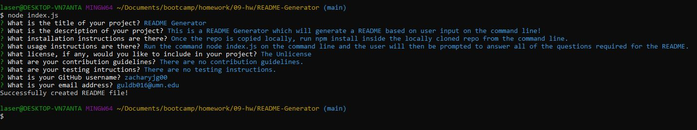

# README-Generator

This is a README Generator. This app uses just node.js and is run from the command line. In order to use, the user must first have node.js installed on their personal machines. From there, they can clone the repo to their local machine and then must run npm install which will install the required dependenceies to run the app. All users must do after the setup is navigate to the repo and run node index.js. Once the app is started, the user will be confronted with a series of prompts for information about the project. Once the user answers all of the prompts, a markdown file with all of the inputted data will be created in the current directory.

**Above is an image of the terminal with the command required to launch the app.**

 

**Above is an image of the terminal after the user has gone through and filled out all of the prompts.**

 

**Above is an image of the README constructed from the inputs in the image above this one.**

 

## Video Demo

Link to a video explanation and demo: https://drive.google.com/file/d/1tQpWU0JdbnENKIBb0aWBoQceVP9AXZfl/view?usp=sharing

